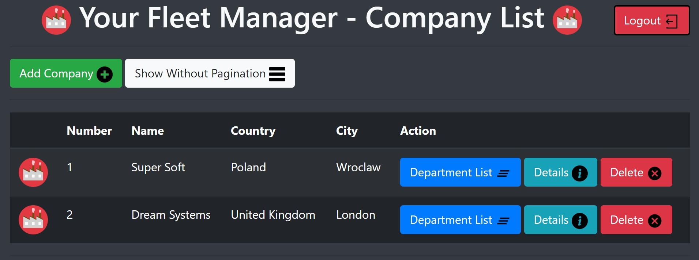
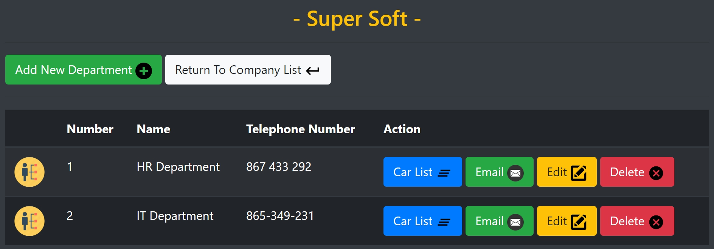
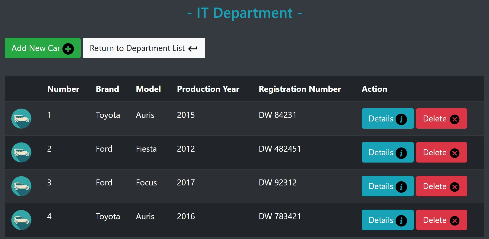

### YourFleetManager
Web CRUD Application designed to manage a fleet of vehicles.

## technology used :
 # - Backend :
     - Spring Boot
     - Spring Data JPA
     - JPA & Hibernate
     - Thymeleaf
     - JUnit
     - Mockito
     - Lombok
 
 # - Frontend : 
     - HTML
     - Boostrap CSS
     
 # - Databases : 
     - MySQL
     - PostgreSQl

 # Launching instruction :

  1.  Download 
  2.  Unzip 
  3.  Go to "SQL" folder and select the appropriate database schema 
  4.  Create database with this schema 
  5.  Load data into the database from the Data folder 
  6.  If you are using PostgreSQL database in application.properties change active profile to "postgresql" 
  7.  In file application-mysql.properties or application-postgresql.properties ( depending on the selected database ) enter correct             database url, username and password. 
  8.  Run Application 
  9.  log in with username: "user" password: "user" on website "http://localhost:8000/" 
  10. Enjoy the management of your fleet of vehicles :)
 
 # Screenshots :
  
  
  
  
  
  
  
