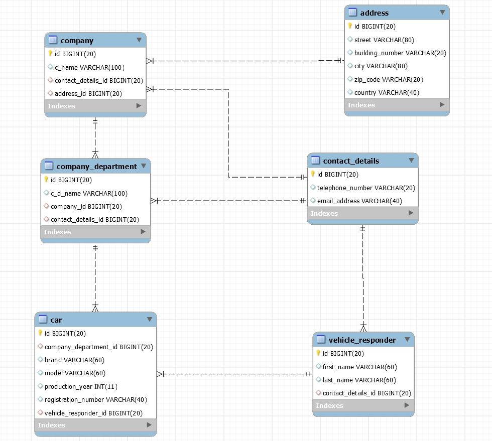

# YourFleetManager
Web Application designed to manage a fleet of vehicles.

The second version of this project created in REST architecture: 
 - https://github.com/DSniatecki/YourFleetManager-REST
 
 *08.2019 I am really not proud of the code quality code and test coverage :)

## technology used :
 ### - Backend :
     - Spring Boot
     - Spring MVC
     - Spring Data JPA
     - JPA & Hibernate
     - Thymeleaf
     - Lombok
     
 ### - Tests : 
     - JUnit
     - Mockito
     
 ### - Frontend : 
     - HTML
     - Boostrap CSS
     
 ### - Databases : 
     - H2 [ embedded ]
     - MySQL
     - PostgreSQl

 ## Launching instruction :

  1.  Download 
  2.  Unzip 
  3.  Go to "SQL" folder and select the appropriate database schema 
  4.  Create database with this schema 
  5.  Load data into the database from the Data folder 
  6.  If you are using PostgreSQL database in application.properties change active profile to "postgresql", if you are using
      MySQL change to "mysql", if you are using H2 change to "h2"
  7.  In file application-mysql.properties, or application-postgresql.properties, or application-h2.properties ( depending on the   
      selected database ) enter correct database url, username and password ( for H2, you do not have to do it ). 
  8.  Run Application 
  9.  log in with username: "user" password: "user" on website "http://localhost:8000/" 
  10. Enjoy the management of your fleet of vehicles :)
  
  ## Database diagram :
  
  
 
 # Screenshots :
  
  
  
  
  
  
  
